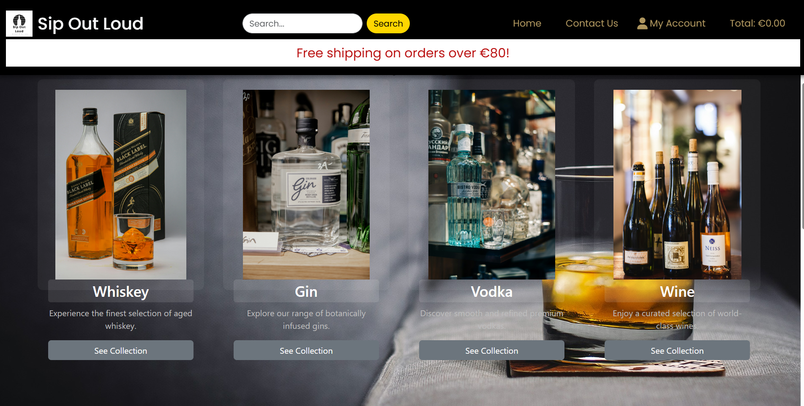
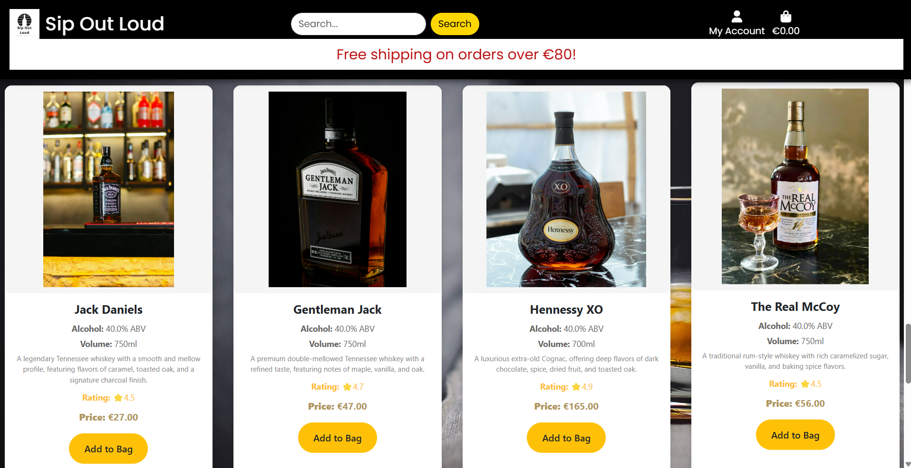
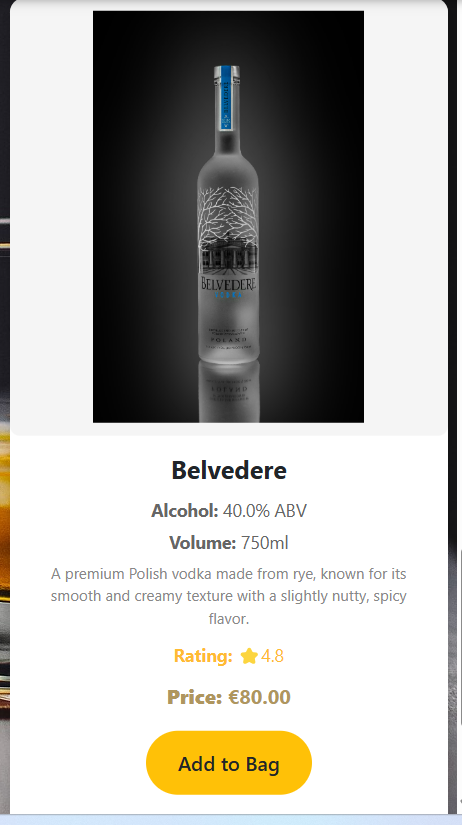
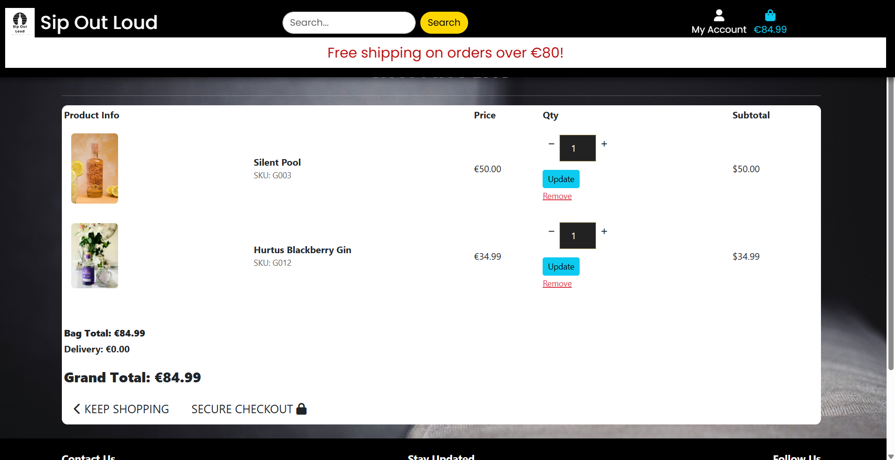

# Sip Out Loud

[Live Website](https://sip-out-loud-p5-9f4dd0f9646d.herokuapp.com/)

## Table Of Contents
- [Introduction](#introduction)
- [User Stories](#user-stories)
- [Design](#design) 
  * [User Feedback](#user-feedback)
- [Application Features](#application-features)
- [UX (User Experience)](#user-experience)
- [Accessibility](#accessibility)
- [Future Features](#future-features)
- [Testing](#testing)  
- [Deployment](#deployment)
- [Technologies](#technologies)
- [Code](#code)  
- [Credits for images](#credits-for-images) 
- [Acknowledgements](#acknowledgements) 

## Introduction
Sip Out Loud is a premium online store offering a curated selection of spirits, including gin, vodka, whiskey, and wine. Designed with a modern and user-friendly interface, this e-commerce platform allows customers to explore various collections, filter products, and seamlessly complete their purchases.

## User Stories

## 1. Browse Beverage Categories
**As a user, I want to browse different categories of alcoholic beverages, so that I can find and explore the types of drinks available.**

- **Acceptance Criteria:**
  - Users can view categories such as Gin, Vodka, Whiskey, and Wine.
  - Each category has a "See Collection" button that displays relevant products.

## 2. Filter Products by Category
**As a user, I want to filter products by category (Gin, Vodka, Whiskey, Wine), so that I can easily find the type of beverage I'm interested in.**

- **Acceptance Criteria:**
  - The user can select a category from the navigation bar or landing page.
  - Products are displayed according to the selected category.

## 3. View Product Details
**As a user, I want to view detailed product information (name, description, price, alcohol percentage, volume, and image), so that I can make informed purchasing decisions.**

- **Acceptance Criteria:**
  - Clicking on a product displays detailed information about the product.
  - The page includes product details like alcohol percentage, volume, price, and an image.

## 4. Add Products to Shopping Bag
**As a user, I want to add items to my shopping bag, so that I can easily purchase multiple items.**

- **Acceptance Criteria:**
  - Each product has an "Add to Bag" button.
  - The shopping bag icon updates when a product is added.
  - The user can view the contents of the bag.

## 5. View and Checkout from Shopping Bag
**As a user, I want to view my shopping bag and proceed to checkout, so that I can purchase the items I've selected.**

- **Acceptance Criteria:**
  - The user can click on the shopping bag to view all items.
  - The user can proceed to checkout and make a purchase using a payment method.

## 6. Register and Log in
**As a user, I want to register and log in to my account, so that I can save my preferences and order history.**

- **Acceptance Criteria:**
  - The user can create an account with email and password.
  - The user can log in to their account and access order history and saved information.

## 7. Manage Product Listings (Admin)
**As an admin, I want to manage product listings, so that I can add, edit, and delete products from the store.**

- **Acceptance Criteria:**
  - Admins can log in to the admin panel.
  - Admins can add, edit, and remove products through the Django admin interface.

## 8. Manage Customer Orders (Admin)
**As an admin, I want to manage customer orders, so that I can view, process, and update the status of customer orders.**

- **Acceptance Criteria:**
  - Admins can view and manage orders.
  - Admins can change the status of orders (e.g., processing, shipped, completed).

## 9. Sort Products
**As a user, I want to sort products by price and rating, so that I can easily find the best deals or highest-rated products.**

- **Acceptance Criteria:**
  - Users can sort products by price (low to high, high to low) and rating (highest to lowest).

## 10. Responsive Website
**As a user, I want the website to be responsive, so that I can browse and shop on any device (desktop, tablet, or mobile).**

- **Acceptance Criteria:**
  - The website is fully responsive and adjusts to different screen sizes.
  - Users can navigate and shop from mobile devices easily.

## User Experience

## 1. Landing Page
The landing page of **Sip Out Loud** greets the user with a visually appealing interface showcasing the most popular categories of alcoholic beverages: Gin, Vodka, Whiskey, and Wine. 

- **User Flow:**
  - The user sees a clean and organized navigation bar with links to the home page, product categories, and shopping bag.
  - Prominent "See Collection" buttons are available for each beverage category, encouraging users to explore.

- **Visual Design:**
  - The color scheme is based on a sleek, modern palette with navy blue, light blue, and accent colors that enhance readability and engagement.
  - Large, high-quality images of products are displayed alongside each category.
  
- **Action Points:**
  - Clicking "See Collection" will take the user to the respective category page to view available products.

## 2. Category Browsing
Once a user clicks a category button, they are taken to a page displaying the products in that specific category.

- **User Flow:**
  - The user can see all products in the selected category with basic information like name, price, alcohol percentage, and a product image.
  - A filter and sort feature are available at the top of the page for better navigation.

- **Visual Design:**
  - The page layout is grid-based for clean and organized product presentation.
  - Product names and prices are clearly visible, and hover effects on product images allow the user to view additional details.
  
- **Action Points:**
  - The user can filter products by price or rating.
  - Each product has a clickable button or image that takes the user to the product details page.

## 3. Product Detail Page
When the user clicks on a product, they are taken to the product detail page for more information.

- **User Flow:**
  - The page includes all relevant product details: a large image, description, alcohol percentage, volume, and price.
  - An "Add to Bag" button is prominently placed below the product details.
  - The user can quickly add the item to their shopping bag and proceed to checkout.

- **Visual Design:**
  - High-resolution product images are displayed alongside the product information.
  - Clear and concise text descriptions make it easy to understand the product features.
  
- **Action Points:**
  - The user can easily add the product to their shopping bag by clicking "Add to Bag."
  - Users can choose to continue shopping or view the contents of their shopping bag at any time.

## 4. Shopping Bag
The shopping bag is easily accessible via an icon located in the top right corner of every page.

- **User Flow:**
  - Clicking the shopping bag icon takes the user to their cart page where they can view all items they have added.
  - The user can modify the quantity or remove items from the bag.
  - There is a button to proceed to checkout.

- **Visual Design:**
  - Each item in the shopping bag is listed with an image, name, price, and quantity.
  - The total cost of the order is displayed at the bottom of the page.
  
- **Action Points:**
  - The user can change the quantity of products or remove them from the cart.
  - A prominent "Proceed to Checkout" button is available to complete the purchase.

## 5. Checkout
The checkout process is simple and secure, guiding the user through all necessary steps to finalize their purchase.

- **User Flow:**
  - The user enters their shipping information, reviews the order, and selects a payment method (e.g., credit card, PayPal).
  - A summary of the order is displayed, including item names, quantities, prices, and shipping details.

- **Visual Design:**
  - A clean, step-by-step layout ensures the user knows what information is required at each stage of the checkout process.
  - Payment options are presented with trusted logos (e.g., credit card icons) for reassurance.

- **Action Points:**
  - The user can easily modify their order or payment method before finalizing the purchase.
  - After payment, the user receives a confirmation of their order, along with estimated delivery details.

## 6. User Authentication (Login/Registration)
Users are encouraged to create an account or log in to manage their orders and save preferences.

- **User Flow:**
  - The login and registration pages are straightforward, asking for minimal details such as email, username, and password.
  - A "Forgot Password?" link is available in case users forget their login credentials.

- **Visual Design:**
  - Clear input fields and large, easy-to-click buttons make registration and login quick.
  - The pages are mobile-friendly, allowing users to easily access their accounts from any device.

- **Action Points:**
  - Once logged in, the user can view their past orders, update profile information, and manage their shipping addresses.

## 7. Admin Panel
The **Sip Out Loud** admin panel is designed to allow store owners or administrators to manage products, orders, and customers.

- **User Flow:**
  - Admins can log in to the Django Admin interface, where they can add, edit, or delete products.
  - They can also manage orders, update the status of orders (processing, shipped, etc.), and view customer information.

- **Visual Design:**
  - The interface is simple and clean, with easy navigation between different sections of the admin panel.
  - Data is presented in tables, and forms are optimized for quick data entry and editing.

- **Action Points:**
  - Admins can add new products, update product details, and delete products as needed.
  - Admins can update order statuses and communicate with customers if necessary.

## 8. Mobile Responsiveness
The website is fully responsive, providing a seamless experience on desktops, tablets, and mobile devices.

- **User Flow:**
  - On smaller screens, the navigation bar collapses into a hamburger menu for easy access.
  - Product pages and checkout are optimized for touch screens.

- **Visual Design:**
  - Buttons are appropriately sized for touch interaction.
  - The layout adapts to different screen sizes, ensuring a consistent experience regardless of the device being used.

- **Action Points:**
  - The user can seamlessly browse products, add items to the shopping bag, and check out, all while using a mobile device.

## Design 
### Key Design Elements:
- **Color Scheme**: Dark, premium aesthetic with navy blue and light blue tones.
- **Typography**: Clean, modern fonts for readability and elegance.
- **Product Display**: Grid layout with high-quality images and essential product details.
- **Navigation**: Intuitive browsing by category (Gin, Vodka, Whiskey, Wine) with sorting options.
- **Call-to-Action Buttons**: "See Collection" and "Add to Bag" enhance user engagement.

  ### 3. Final UI Screenshots  
Below are screenshots of the final design after implementation:  

- **Homepage**  
    

- **Category Page (Gin, Vodka, Whiskey, Wine)**  
    

- **Product Details Page**  
    

- **Shopping Cart & Checkout Page**  
    
 

## User Feedback  
### ✅ Positive Feedback  
- **Elegant design** with a premium shopping experience.
- **Easy navigation** through "See Collection" buttons and category pages.
- **Detailed product pages** with alcohol percentage, volume, and rating.

### 🔹 Areas of Improvement  
- **Sorting & Filtering**: Added sorting by price, rating, and alcohol percentage.
- **Mobile Responsiveness**: Optimized layouts for smaller screens.
- **Cart Feedback**: Improved "Add to Bag" styling with visual confirmation.

## Application Features
- **User Authentication**: Secure login, registration, and password reset.
- **Product Browsing & Filtering**: Categories, sorting by price, rating, alcohol percentage.
- **Product Details & Reviews**: SKU, volume, alcohol percentage, rating, user reviews.
- **Shopping Cart & Checkout**: Secure Stripe payment, order summary, confirmation emails.
- **Admin Features**: Product and order management via Django Admin.
- **Mobile-Friendly Design**: Fully responsive for all devices.

## Backend Logic
### Database Models (PostgreSQL)
- `Category`: Defines product categories.
- `Product`: Stores details such as SKU, alcohol percentage, volume, rating, and image.
- `Order`: Tracks purchases and payment details.
- `UserProfile`: Stores user data and order history.

### Shopping Cart & Checkout
- **Session-based cart management**.
- **Stripe payment integration** for secure transactions.
- **Email order confirmation** upon successful purchase.

## User Experience: First-Time User
### 1. **Landing on Homepage**
- A visually appealing interface with high-quality product images.
- "See Collection" buttons for easy category navigation.

### 2. **Browsing Products**
- Well-structured categories for quick access.
- Detailed product descriptions and filtering options.

### 3. **Adding Items to Cart & Checkout**
- "Add to Bag" with real-time cart updates.
- Secure checkout with Stripe integration.
- Order confirmation email with purchase details.

## Accessibility
- **High color contrast** for readability.
- **Keyboard navigation** support.
- **Screen reader compatibility**.
- **Clear error messages** for better guidance.

## Future Features
- **Additional Payment Gateways**.
- **Multi-product checkout enhancements**.
- **Admin dashboard with sales analytics**.
- **Mobile app version for easier access**.

## Testing
### User Story Testing
- **Login**: Valid and invalid login attempts tested.
- **Booking Process**: Ensured correct cost calculation and booking functionality.
- **Admin Access**: Verified order management tools.

### Feature Testing
- **Room Selection**: Ensured correct filtering and display.

[CI Python Linter](https://pep8ci.herokuapp.com/#)

## Deployment
### Heroku Deployment Steps
1. Sign into [Heroku](https://dashboard.heroku.com/apps).
2. Create a new Heroku app with a unique name.
3. Set up Config Vars with `PORT=8000`.
4. Add `python` and `nodejs` buildpacks.
5. Connect GitHub repository and deploy branch.

## Technologies
- **Django**: Web framework for backend logic.
- **PostgreSQL**: Database management.
- **Stripe**: Secure payment processing.
- **HTML/CSS/JavaScript**: Frontend styling and interactivity.
- **AWS/Cloudinary**: Image storage.
- **Heroku**: Hosting and deployment.

## Code
- [Code Institute](https://learn.codeinstitute.net/dashboard)
- **Programming with Mosh** - [YouTube](https://www.youtube.com/@programmingwithmosh)

## Credits for Images
All images sourced from [Unsplash](https://unsplash.com/).

## Acknowledgements
- **Mentor Guidance**: Special thanks to my mentor for their invaluable advice.
- **Slack Community**: For support and troubleshooting assistance.
- **Code Institute Team**: For providing resources and guidance.
